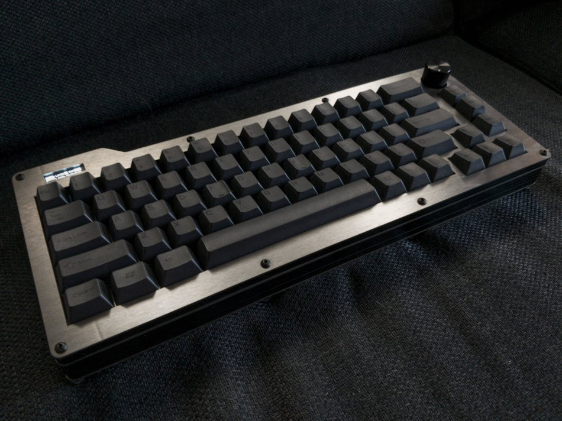
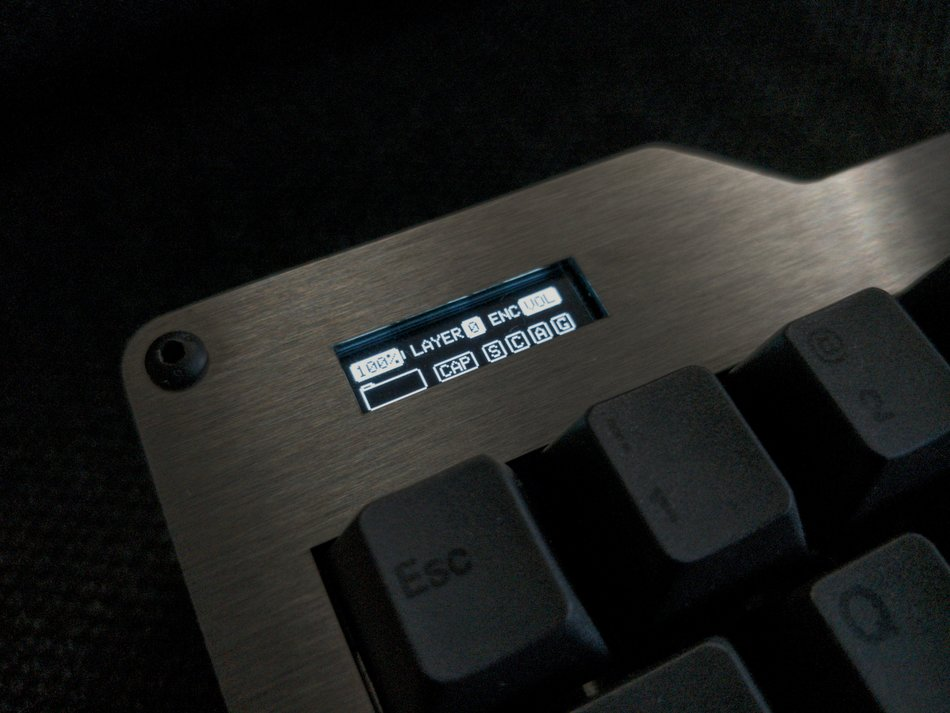
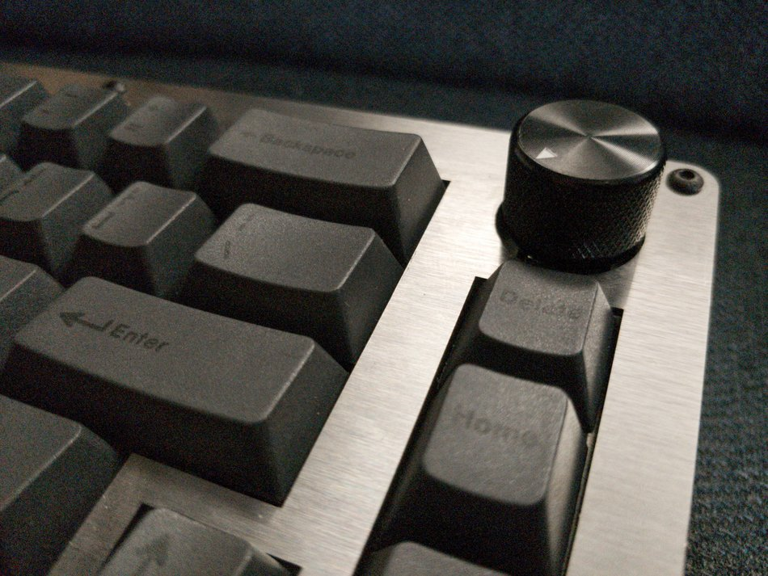

# Dissatisfaction65

  

This is the hardware repository for my 65% QMK Bluetooth keyboard with an OLED and encoder.

# Software (QMK)
You can currently find the firmware for this board at [my qmk-firmware fork](https://github.com/Nicell/qmk_firmware/tree/dissatisfaction-65). It requires [this pull-request](https://github.com/qmk/qmk_firmware/pull/7769) before it can be fully upstreamed.

# What you'll need (or at least what I used)
You can get most of these items at different places, but I left the more convenient places here. Often you can get cheaper electronics at LCSC and AliExpress rather than Mouser and Amazon.
 - Adafruit Feather 32u4 Bluefruit LE [BUY](https://www.amazon.com/Adafruit-Feather-32u4-Bluefruit-ADA2829/dp/B01GJR9MNI)
 - 2500mAH battery or equivalent (probably don't go thicker) [BUY](https://www.amazon.com/Adafruit-328-Battery-Lithium-Polymer/dp/B01NAX9XYG)
 - EC12 Encoder Knob [BUY](https://www.amazon.com/Cylewet-Encoder-Digital-Potentiometer-Arduino/dp/B07DM2YMT4)
 - OLED SSD1306 128x32 [BUY](https://www.amazon.com/MakerFocus-Display-SSD1306-3-3V-5V-Arduino/dp/B079BN2J8V)
 - Long headers for the OLED to reach far down [BUY](https://www.mouser.com/ProductDetail/fci-amphenol/68653-105hlf)
 - 1N4148 DO-35 package 67x [BUY](https://www.mouser.com/ProductDetail/on-semiconductor/1n4148tr)
 - 74HC4515 Decoder [BUY](https://www.mouser.com/ProductDetail/nexperia/74hc4515d653)
 - On-Off switch [BUY](https://www.mouser.com/ProductDetail/alps/sddjf1a100)
 - Encoder Knob [BUY](https://www.amazon.com/dp/B07Z1MQ9T7)
 - M3 ([Bolts](https://www.amazon.com/gp/product/B075CFBHWV)) ([Nuts](https://www.amazon.com/gp/product/B01IWUSDYY)) ([Lock Nuts](https://www.amazon.com/gp/product/B07MD7SPBJ)) ([Rubber Feet](https://www.amazon.com/gp/product/B07CNQC695))
 - Plates: one of each of the plates found in the DXF folder. Middle MUST be 1.5mm. I got mine from SendCutSend in brushed stainless steel using the combined plates file. I highly recommend them. Fast, affordable, and good quality.
 - Middle pieces: 7x of the middle piece found in the DXF folder. I used 1/8in thick pieces. 2x between the top and switch plate, and 5x between the bottom and switch plate. The second and third to last from the bottom pieces need cutouts for both the micro USB and the power switch. I got mine from Sculpteo. I would not recommend them. The wait was long, the order was messed up, and the quality was very mediocre. There was an obvious taper on the cuts.
 - MX style switches 67x. PCB or plate mount
 - Keycaps! KLE can be found [here](http://www.keyboard-layout-editor.com/#/gists/c38820c1ede8c90e253ba465600c6e75).

# Things I'd like to change
There were a few things that I'd like to change. I haven't done them yet, but they would enhance the board.
 - Move the encoder switch to the matrix. Currently has its own direct connection.
 - Recreate the switch plate using ai03's plate designe. Currently has huge lines across stabs and stab holes really tight.
 - Re-dimension the OLED. It seems to be barely too far down and to the left. I can re-dimension now that I have calipers.
 - Redo the decoder using a 74HC154. No need to use the latched version that's more expensive and slower.
 - Create a little cut in the middle pieces to use as a prop up for the OLED.
 - Create pre-made middle pieces with cutouts for the micro USB port and the on-off switch rather than cutting them manually.

# Random things I encountered
 - Make sure to test your Adafruit board fully before soldering it in. The board I got had a working MCU and Bluetooth module, but they couldn't communicate properly despite continuity between the SPI pins.
 - My plate ended up flexing a bit when connecting the switches. I suspect the PCB was either a bit too small or the plate was a bit too big. I really don't know why this was the case.

# Thanks to
 - QMK team for helping me with getting the firmware working
 - Nick_68 and WoodKeys for each of their iterations on the Bluetooth + decoder design with the Ronin and Meira, which were invaluable for me while I was designing this board.
 - ai03 for the MX KiCad library I have in this project.

# Images

